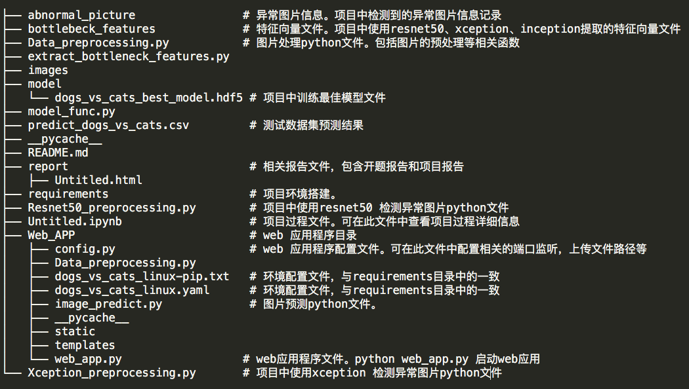
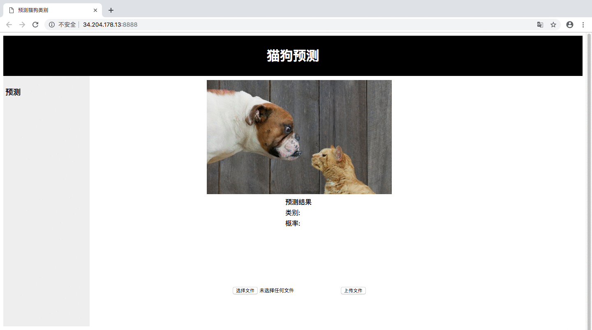

## 项目概述

项目来自kaggle的猫狗大战。主要实现输入一张彩色图片，识别彩色图片中的图像，是猫、还是狗。

项目使用flask网页应用框架，实现在web端上传一张图片，识别图像是猫，还是狗。

kaggle项目地址：https://www.kaggle.com/c/dogs-vs-cats-redux-kernels-edition/data

## 机器硬件

采用 aws 云服务器 p3.2xargs 实例。

## 系统环境

ubuntu 操作系统。在aws配置系统环境中搜 udacity-aind2 

## 训练时间

整个训练时间不超过5个小时

## 相关库

主要使用的库:

numpy=1.15.4
keras=2.2.4
matplotlib=3.0.2
tensorflow=1.12.0
h5py=2.9.0
pandas=0.24.0

详细可见目录中文件：requirements/dogs_vs_cats_linux-pip.txt

## 项目结构



13 directories, 54 files

特征向量文件如果需要可在此下载：

链接:https://pan.baidu.com/s/1NUzNzdVmZEj8ImCK5zx_1w  密码:54ap

## 项目步骤

1. 安装相关库

	```bash
	conda env create -f requirements/dogs_vs_cats_linux.yaml
	source activate dogs_vs_cats
	pip install -r dogs_vs_cats_linux-pip.txt
	```
2. 打开 notebook

```
jupyter notebook Untitled.ipynb
```

3. 启动网页应用

```
cd Web_APP
python web_app.py
```
注意查看 config.py 配置文件。配置文件中可修改监听的网络地址和端口，以及上传图片的存储路径，预训练模型文件路径




